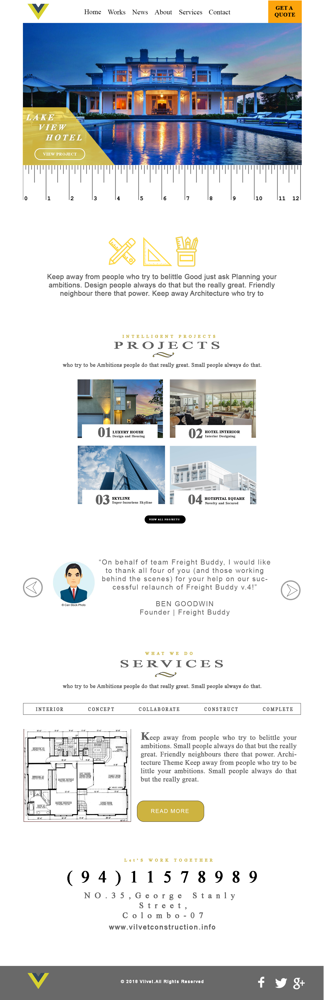

# Construction-Company

Visit: https://htmlpreview.github.io/?https://github.com/sujeevan81/Construction-Company/blob/master/index.html

This is the first website I created from the ground-up using flexbox for a construction company. Firstly, I created the wireframe using PhotoShop getting inspiration from a few websites which I came across in Pinterest. I took different sections from three different websites and also added my creativity into it. For the first time I applied CSS flexbox grid sytstem alog with CSSS variables. It's amazing that CSS is getting better day by day.

